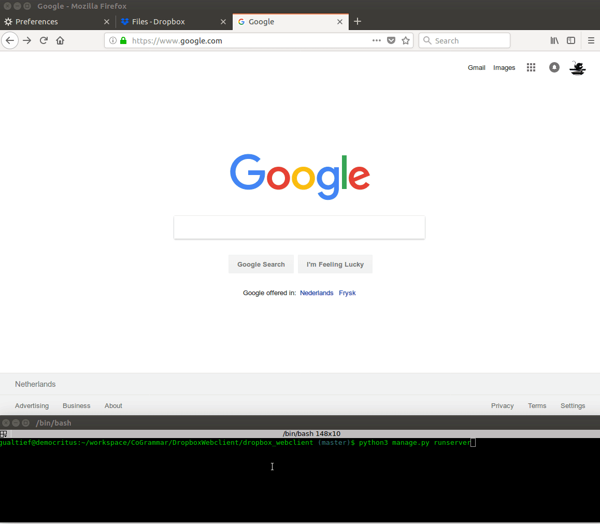

<!-- START doctoc generated TOC please keep comment here to allow auto update -->
<!-- DON'T EDIT THIS SECTION, INSTEAD RE-RUN doctoc TO UPDATE -->
**Table of Contents**

- [Dropbox Webclient](#dropbox-webclient)
    - [Overview](#overview)
    - [Requirements](#requirements)
      - [Dropbox Access Token](#dropbox-access-token)
      - [Software Dependencies](#software-dependencies)
    - [Building the App](#building-the-app)
    - [Running the App](#running-the-app)
    - [Running Tests](#running-tests)
    - [Developer's Guide](#developers-guide)
  - [Resetting Migrations](#resetting-migrations)

<!-- END doctoc generated TOC please keep comment here to allow auto update -->

# Dropbox Webclient

<kbd></kbd>

### Overview

This project consists of a web GUI wrapper for the [Python implementation of the Dropbox API V2](https://www.dropbox.com/developers/documentation/python).

Despite of what the app's name might suggest, it's not the intention of this project to cover all of the functionality offered by the Dropbox API. Only a single feature is implemented at the moment: Uploading files to a Dropbox folder.

A user might use this web app to browse a file from the local file system and upload it to Dropbox.

The purpose of this project is to showcase some of my skills developing web applications using the Django Framework, specifically templates.

I already have a [REST API developed with Django in my portfolio](https://github.com/marciogualtieri/risk_model_builder), so I thought that a sample code showing front-end development with Django alone would be interesting.

Some of the skills this app aims to showcase:

- Creation of a Django project from scratch.
- Use of Django models and templates.
- Django authentication setup.
- Extension of the Django user model to support additional fields (the Dropbox access token).
- Use of static files in Django (the CSS file).
- Basic HTML/CSS (I'm also using bootstrap).
- Integration with the Dropbox API.

### Requirements

#### Dropbox Access Token

The Dropbox API requires an authentication token (which is provided to the user on the creation of a [Dropbox app](https://www.dropbox.com/developers/apps/create)).

For this reason, I have opted to leverage Django's authentication capabilities: This app's user is required to have a valid account.

Once the account is created, the user may edit ones profile and save ones Dropbox token.

You will need a valid Dropbox account. Create a [Dropbox app](https://www.dropbox.com/developers/app) for your account and generate its correspondent access token.

#### Software Dependencies

This app has been developed using Python 3.6.3 and Django 1.9.0.

On Ubuntu Linux, you may execute the following command on a terminal to install this version:

    sudo pip3 install "Django~=1.9.0"

### Building the App

Initialize the database by running the following command on a terminal:

    python3 manage.py migrate

Create a superuser:

    python3 manage.py createsuperuser --username=admin --email=your.email.here@some.domain

You will be asked for a password.

### Running the App

Execute the following command to start the service:

    python3 manage.py runserver

Note that the admin user is required to create a test user setup with a valid Dropbox token.

### Running Tests

The following command will execute the unit tests:

    python3 manage.py test -v 2

You should get an output similar to the following:

    Creating test database for alias 'default' ('file:memorydb_default?mode=memory&cache=shared')...
    Operations to perform:
      Synchronize unmigrated apps: staticfiles, messages
      Apply all migrations: auth, uploader, admin, sessions, contenttypes
    Synchronizing apps without migrations:
      Creating tables...
        Running deferred SQL...
    Running migrations:
      Rendering model states... DONE
      Applying contenttypes.0001_initial... OK
      Applying auth.0001_initial... OK
      Applying admin.0001_initial... OK
      Applying admin.0002_logentry_remove_auto_add... OK
      Applying contenttypes.0002_remove_content_type_name... OK
      Applying auth.0002_alter_permission_name_max_length... OK
      Applying auth.0003_alter_user_email_max_length... OK
      Applying auth.0004_alter_user_username_opts... OK
      Applying auth.0005_alter_user_last_login_null... OK
      Applying auth.0006_require_contenttypes_0002... OK
      Applying auth.0007_alter_validators_add_error_messages... OK
      Applying sessions.0001_initial... OK
      Applying uploader.0001_initial... OK
    test_check_connection_with_invalid_token (dropbox_webclient.tests.dropbox.test_dropbox_client.TestDropboxClient) ... ok
    test_check_connection_with_valid_token (dropbox_webclient.tests.dropbox.test_dropbox_client.TestDropboxClient) ... ok
    test_copy_file (dropbox_webclient.tests.dropbox.test_dropbox_client.TestDropboxClient) ... ok
    test_delete_file (dropbox_webclient.tests.dropbox.test_dropbox_client.TestDropboxClient) ... ok
    test_list_files (dropbox_webclient.tests.dropbox.test_dropbox_client.TestDropboxClient) ... ok

    ----------------------------------------------------------------------
    Ran 5 tests in 0.305s

    OK
    Destroying test database for alias 'default' ('file:memorydb_default?mode=memory&cache=shared')...

I'm using Python unittest. Specifically for mocking the Dropbox API, so a live connection to Dropbox isn't required, I'm unittest.mock.

### Developer's Guide

#### Resetting Migrations

For my own future reference, to reset the migrations, delete all files under `migrations`  (excepting `__init__.py`), delete `db.sqlite3` as well, then execute the following command on a terminal:

    python3 manage.py makemigrations
